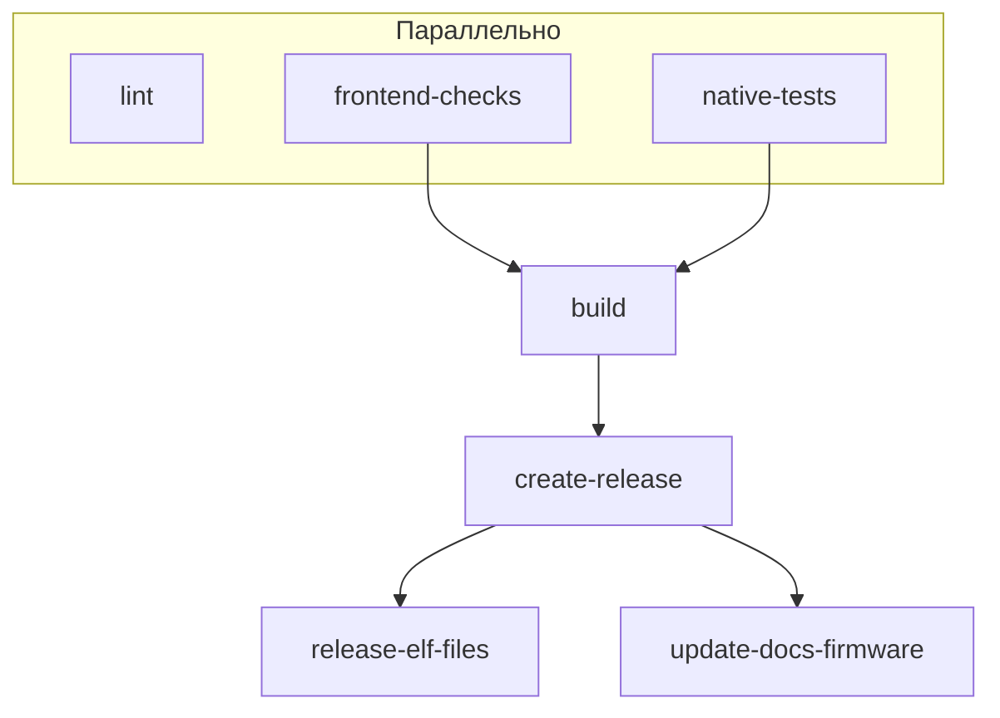

# Сборка прошивки

## Локальная сборка

```bash
pio run
```

Сборка по всем целям (8m, 8m-secure, 16m, 16m-secure):

```bash
pio run -e esp32-s3-devkitc-1-8m -e esp32-s3-devkitc-1-8m-secure -e esp32-s3-devkitc-1-16m -e esp32-s3-devkitc-1-16m-secure
```

## Скрипты обновления docs/firmware

Скрипты копируют `*_webflash.bin` в `docs/firmware/`, создают JSON-манифесты и обновляют `manifest_index.json` для страницы флешера.

### update_firmware_docs.py

Основной скрипт. Источники: локальная сборка, артефакты CI или релизы GitHub.

| Режим | Команда | Описание |
|-------|---------|----------|
| Локально | `python scripts/docs/update_firmware_docs.py` | Сборка PlatformIO + копирование из `build/` |
| Из build/ | `python scripts/docs/update_firmware_docs.py build` | Копирование из `build/` без сборки |
| Из артефактов | `python scripts/docs/update_firmware_docs.py all-artifacts 0-2-6-1` | Копирование из `all-artifacts/`, версия в формате `0-2-6-1` |
| С GitHub | `python scripts/docs/update_firmware_docs.py --github` | Загрузка стабильной и тестовой версий с GitHub Releases |
| Только индекс | `python scripts/docs/update_firmware_docs.py --manifest-only` | Пересоздать `manifest_index.json` по файлам в `docs/firmware/` |

При `--github` скрипт создаёт `release_meta.json` с метаданными (stable/test из API GitHub).

### Флаг --manifest-only

Только пересоздать `manifest_index.json` (файлы уже в `docs/firmware/`):

```bash
python scripts/docs/update_firmware_docs.py --manifest-only
```

Логика manifest_index:
- Если есть `release_meta.json` (от `--github`): использует stable/test из него; версии новее тестовой попадают в секцию `local`.
- Иначе: stable = предпоследняя версия, test = последняя.

### Логика категорий на странице флешера

| Категория | Источник | Описание |
|-----------|----------|----------|
| Стабильная версия | `prerelease=false` на GitHub | Последний стабильный релиз |
| Тестовая версия | `prerelease=true` на GitHub | Последний предрелиз |
| Локальная сборка | Версии новее тестовой | Неопубликованные сборки (собраны локально) |

---

## CI (GitHub Actions)

Workflow: `.github/workflows/firmware.yaml`

### Триггеры

- `push` в любую ветку
- `push` тега `v*` (например `v0.2.6.1`)
- `pull_request` в main/master
- `workflow_dispatch` (ручной запуск)

### Jobs



| Job | Условие | Описание |
|-----|---------|----------|
| lint | всегда | PlatformIO check (continue-on-error) |
| frontend-checks | всегда | npm build, тесты Vitest |
| native-tests | всегда | `pio test -e native` |
| build | после frontend, native | Сборка по 4 окружениям (matrix) |
| create-release | при теге `v*` | Создание релиза, загрузка bin/zip |
| release-elf-files | при теге `v*` | Добавление elf-files.zip в релиз |
| update-docs-firmware | при теге `v*` | Обновление docs/firmware и push в main |

### update-docs-firmware (сборочная линия)

При пуше тега `v*`:

1. Checkout `main`
2. Скачивание артефактов сборки в `all-artifacts/` (структура: `all-artifacts/firmware-esp32-s3-devkitc-1-8m/`, …)
3. Запуск: `python scripts/docs/update_firmware_docs.py all-artifacts 0-2-6-1`
4. Коммит и push `docs/firmware/`

Скрипт ищет `*_webflash.bin` в `all-artifacts/` (включая подпапки), копирует в `docs/firmware/`, создаёт JSON-манифесты и `manifest_index.json`.

!!! note "release_meta.json"
    При запуске из CI `release_meta.json` не обновляется (используется `all-artifacts`, а не `--github`). Категории stable/test берутся из существующего `release_meta.json` или из логики по версиям.

### Версия в сборке

- При теге `v0.2.6.1` → версия `0-2-6-1`
- При PR → версия `pr-{sha8}`
