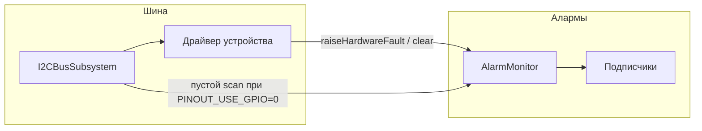

# Мониторинг I2C и алертинг (прошивка)

Документ описывает, как в **ssvcOpenConnect** устроены шина I2C, обнаружение сбоев и доставка событий подписчикам (`AlarmMonitor`). Исходники прошивки лежат в каталоге `lib/ssvcOpenConnect/` репозитория.

---

## 1. Роль компонентов

| Компонент | Назначение |
|-----------|------------|
| **I2CBusSubsystem** | Единственное место вызова `Wire.begin` для приложения; `getWire()` / `isActive()`; при старте — сканирование адресов 1…126. |
| Драйверы устройств (например **Pcf8574Output**, **Pcf8574RelayPort**) | Работа только с переданным `TwoWire*`; **не** вызывают `Wire.begin`. |
| **AlarmMonitor** | Рассылка событий; для I2C — `raiseHardwareFault` / `clearHardwareFault` с дедупликацией по паре **роль + адрес**. |
| **IAlarmSubscriber** | Интерфейс подписчика: `onAlarm(const AlarmEvent&)`. |

Шина и алерты **не привязаны к конкретной плате**: адреса, роли и пины задаются макросами сборки (см. `SsvcConnector.h`, `platformio.ini`).

---

## 2. Два типа событий в `AlarmEvent`

Структура **AlarmEvent** (объявление в `IAlarmSubscriber.h`) различается полем `source_kind`:

- **`AlarmSourceKind::SENSOR`** — пороги датчиков (`sensor`, пороги, `AlarmLevel`). Формируется в `AlarmMonitor::checkAllSensors()`.
- **`AlarmSourceKind::HARDWARE_FAULT`** — сбой инфраструктуры (в т.ч. I2C): `sensor == nullptr`, заполняются `hw_code`, `hw_i2c_address`, `hw_device_role` (строка-идентификатор роли, обычно указатель на строковый литерал во flash).

Коды **HardwareFaultCode**:

| Код | Смысл (типичное использование) |
|-----|--------------------------------|
| `I2C_NACK` | Транзакция I2C завершилась с ошибкой (устройство не ответило). |
| `I2C_BUS_DOWN` | Шина недоступна или при сканировании не найдено ни одного устройства (см. ниже). |
| `DEVICE_NOT_PRESENT` | Резерв под явное «устройство отсутствует» (по мере внедрения). |

Уровень для активного сбоя обычно **`CRITICAL`**; при снятии fault рассылается событие с `level == NORMAL` и тем же `source_kind`.

---

## 3. Поведение шины при старте

1. Подсистема `i2c_bus` регистрируется в **SubsystemManager** и при включении вызывает `I2CBusSubsystem::enable()`.
2. Выполняется `scan()`: подсчёт отвечающих адресов.
3. Если **ни одного устройства не найдено**, подсистема отключается (`disableSubsystem("i2c_bus")`).
4. Если в сборке **`PINOUT_USE_GPIO=0`** (выходы алармов завязаны на I2C, например PCF8574), при пустом сканировании дополнительно вызывается  
   `AlarmMonitor::raiseHardwareFault(I2C_BUS_DOWN, 0, "i2c_bus")`  
   — чтобы зафиксировать критическую ситуацию «реле/выходы через I2C недоступны».

При **`PINOUT_USE_GPIO=1`** GPIO-алармы не зависят от PCF8574; пустое сканирование не порождает этот hardware fault (остаётся только отключение подсистемы и лог).

---

## 4. Как добавить новое I2C-устройство

Общие правила:

1. **Не вызывать `Wire.begin`** в драйвере устройства — только `I2CBusSubsystem::getInstance().getWire()` после проверки `isActive()`.
2. Задать **уникальную строковую роль** `device_role` для алармов (стабильная строка на весь срок работы, лучше литерал в flash), например `"bmp581"`, `"pcf8574_port1"`.
3. При ошибке обмена (например `Wire.endTransmission() != 0`) вызывать  
   `AlarmMonitor::getInstance().raiseHardwareFault(HardwareFaultCode::I2C_NACK, i2c_addr, device_role)`  
   не в цикле на каждый тик без ограничений — монитор **дедуплицирует** повторы одного и того же перехода в `CRITICAL`, но лишние вызовы всё равно лучше избегать.
4. После **успешной** операции, если ранее был fault по этой роли/адресу, вызывать  
   `clearHardwareFault(device_role, i2c_addr)`  
   (по аналогии с `Pcf8574RelayPort::flush()`).

Несколько одинаковых чипов (несколько PCF8574): отдельный экземпляр порта на каждый **адрес** и своя **роль** (`pcf8574_port0`, `pcf8574_port1`, …), чтобы ключи в `AlarmMonitor` не пересекались.

---

## 5. Настройка без перекомпиляции (частично)

Через **`platformio.ini`** / `build_flags` задаются, в частности:

- `SSVC_I2C_SDA_GPIO`, `SSVC_I2C_SCL_GPIO` — пины шины;
- `PINOUT_USE_GPIO` — `1` (только GPIO для алармов) или `0` (путь через PCF8574 и макросы `SSVC_RELAY_PCF8574_*`);
- `SSVC_RELAY_PCF8574_I2C_ADDR`, `SSVC_RELAY_PCF8574_DEVICE_ROLE`, биты для DANGEROUS/CRITICAL — см. макросы в `SsvcConnector.h`.

Пороги **датчиков** по-прежнему настраиваются через **AlarmThresholdService** и веб-интерфейс; это относится к `source_kind == SENSOR`, не к `HARDWARE_FAULT`.

---

## 6. Подписчики и пользовательские действия

Подписчики регистрируются через `AlarmMonitor::subscribe`:

| Подписчик | Поведение |
|-----------|-----------|
| **NotificationSubscriber** | Push/UI: для `HARDWARE_FAULT` формирует текст по роли и адресу; для датчиков — по порогам. Периодические повторы таймером для hardware дублируют последнее событие. |
| **HardwareFaultLogSubscriber** | Заглушка: логирует hardware-события в Serial. |
| **PinOutSubscriber** | Игнорирует `HARDWARE_FAULT` в `onAlarm`, чтобы не зациклить запись в I2C при сбое; управляет GPIO или `Pcf8574RelayPort` по **датчиковым** уровням. |

**Новый обработчик:** класс, реализующий `IAlarmSubscriber`, в конструкторе `AlarmMonitor::getInstance().subscribe(this)`, в `onAlarm` различать `event.source_kind` и при необходимости ветвить по `event.hw_device_role` / `event.hw_i2c_address`.

---

## 7. Схема потока (I2C fault)

---

## 8. См. также

- Таблица адресов и пример разводки платы: [I2C_devices.md](../boards/kc868-a6/I2C_devices.md), [GPIO_Pinout.md](../boards/kc868-a6/GPIO_Pinout.md) (KC868-A6 как пример платы).
- API подсистем (включая `i2c_bus` через REST, если доступно в сборке): [subsystem.md](api/subsystem.md).
