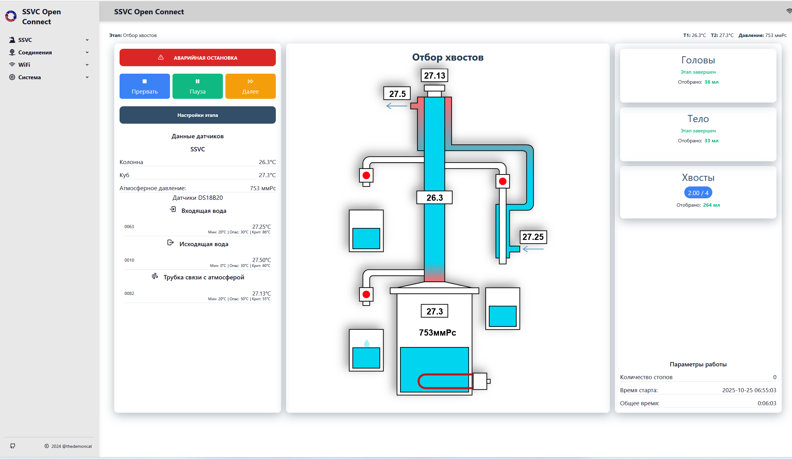
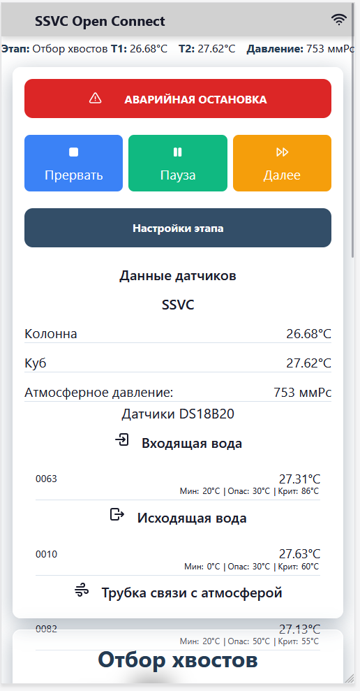

# SSVC0059 Open Connect

 

 

Модуль SSVC0059 Open Connect предназначен для расширения возможностей автоматики отбора для ректификации [SSVC0059 V2 ](https://smartmodule.ru/portfolio/0059_v2/)

## Возможности модуля

### :desktop:  WEB интерфейс

Open Connect в первую очередь предназначен для обеспечения доступа к параметрам работы контроллера, предоставляя удобный интерфейс для управления настройками, процессом ректификации через браузер на компьютере, телефоне или другом устройстве, поддерживающим современные возможности.
Контроллер способен отображать, обрабатывать данные телеметрии SSVC0059, управлять настройками, манипулировать непосредственно процессом ректификации.

### :thermometer: Внешние датчики

Подключение внешних сенсоров. В настоящее время доступно подключение произвольного количества датчиков температуры DS18B20, например для контроля входящей, исходящей воды, контроля температуры ТСА и других узлов. Важно, что датчики группируются по зонам, а на сам датчик можно накладывать пороги значений. Подробности — в разделе [Датчик температуры DS18B20](usage/interfaces/ds18b20.md).

### :shield: Пороги датчиков.

Для каждого из существующих датчиков возможно наложение определенных ограничений, которые в дальнейшем позволят более оперативно регулировать процессом ректификации, например позволят прерывать процесс, если температура ТСА или исходящей воды превышает допустимое значение.

!!! warning "ВНИМАНИЕ"
    Подсистема порогов, а так же безопасности не должна снижать внимание оператора от производственного процесса, а так же не исключает, а дополняет другие группы безопасности.  

### :arrows_counterclockwise: Обмен данными с MQTT

Контроллер реализует обмен данными и командами управления через брокер сообщений MQTT: публикует телеметрию и события в заданные топики и может получать команды управления (запуск, пауза, настройки), что позволяет встраивать ректификацию в системы умного дома (Home Assistant и др.). Поддержка MQTT включается при сборке прошивки (флаг `FT_MQTT`). Подробности — в разделе [Для разработчиков](develop/build.md#другие-флаги-сборки).

### :material-electric-switch: Управление реле

Предусмотрено подключение внешней платы с реле для управления нагрузкой. На текущий момент поддержка управления внешними реле в прошивке находится в разработке; разъём на готовых модулях выполнен с расчётом на будущее расширение. Текущее состояние описано в разделе [Управление внешним оборудованием через пины вывода](usage/interfaces/pin_out.md).

### :simple-telegram: Доступ к телеметрии через Telegram

Подсистема Telegram-бота даёт возможность получать уведомления о состоянии процесса (телеметрия, события, срабатывание порогов) и при необходимости управлять настройками через чат. Бот настраивается токеном от @BotFather и вашим chat_id; параметры задаются в веб-интерфейсе Open Connect. Пошаговая инструкция — в разделе [Настройка Telegram-бота](usage/telegram.md). 

### Полезные cсылки

<a href="https://t.me/demoncat_home" target="_blank">
    :simple-telegram: Группа проекта в Telegram
</a>

<a href="https://github.com/SSVC0059/ssvc_open_connect" target="_blank">
    :simple-github: Репозитарий Github
</a>

<a href="https://rutube.ru/plst/937235/" target="_blank">
    :material-youtube: Видео инструкции
</a>

<a href="https://t.me/ssvc0059_chat" target="_blank">
    :simple-telegram: Группа производителя SSVC в Telegram
</a>

