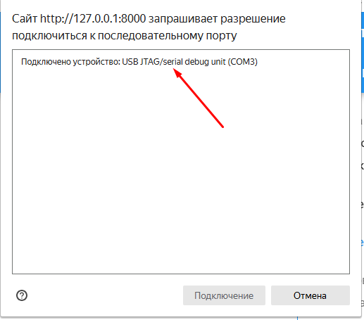

# Автоматическая установка актуальной версии

!!! info inline end
    Если загрузка актуальных прошивок происходит долго - обновите страницу

## Использование установщика

Установщик позволяет в автоматическом режиме установить актуальную или тестовую прошивку с правильным смещением. Для его использования на компьютере должны быть установленны драйвера.

## Прошивка контроллера

1. Подключите контроллер проводом к компьютеру проводом и убедитесь что драйвера установленны

2. Нажмите [кнопку установки](#flash-tool), которая соответствует вашему чипу

!!! warning "ВНИМАНИЕ"
    Так как прошивальщик не может точно определить модель вашего чипа, то критически важно правильно выбрать тип.
    Убедитесь, что прошивка соответствует установленной памяти на вашем чипе. Подробнее как это определить - [читаем в начале](controller.md) 

После нажатия появится окно выбора контроллера.

После выбора появится меню, в нем выбираем установку и дале следуем пунктам мастера. При первоначальной установке или при не корректной работе желательно произвести очистку.

!!! warning "ВНИМАНИЕ"
    При установке стабильной или тестовой версии через кнопку возможна полная очистка данных.
    Рекомендуется сохранить настройки telegramm бота и mqtt, если они были установленны ранее.

 
 
 

## Flash Tool

    

        
🚀 Стабильная Версия (0.2.4.2)

        <esp-web-install-button manifest="/ssvc_open_connect/firmware/manifest_16m_0-2-4-2.json">
            <button slot="activate">16MB Flash</button>
            ❌ Ошибка: Ваш браузер не поддерживает Web Serial API.
            ⚠️ Внимание: Установка требует HTTPS-соединения.
        </esp-web-install-button>

        <esp-web-install-button manifest="/ssvc_open_connect/firmware/manifest_8m_0-2-4-2.json">
            <button slot="activate">8MB Flash</button>
            ❌ Ошибка: Ваш браузер не поддерживает Web Serial API.
            ⚠️ Внимание: Установка требует HTTPS-соединения.
        </esp-web-install-button>
    

    

        
🚀 Стабильная Версия (0.2.1.8)

        <esp-web-install-button manifest="/ssvc_open_connect/firmware/manifest_16m_0-2-1-8.json">
            <button slot="activate">16MB Flash</button>
            ❌ Ошибка: Ваш браузер не поддерживает Web Serial API.
            ⚠️ Внимание: Установка требует HTTPS-соединения.
        </esp-web-install-button>

        <esp-web-install-button manifest="/ssvc_open_connect/firmware/manifest_8m_0-2-1-8.json">
            <button slot="activate">8MB Flash</button>
            ❌ Ошибка: Ваш браузер не поддерживает Web Serial API.
            ⚠️ Внимание: Установка требует HTTPS-соединения.
        </esp-web-install-button>
    

